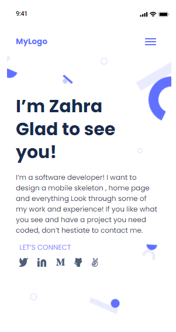

# microverse-project1
 creating a portfolio website

# Portfolio

> the first project of microverse which should look like screenshot below:

Additional features will be add during first module of learning...

## Built With

- HTML
- CSS

## Live Demo
live demo will be add after finishing the project.
[Live Demo Link](https://livedemo.com)

## Authors

👤 **Zahra**

- GitHub: [@githubhandle](https://github.com/ZahraArshia)

## Show your support

Give a ⭐️ if you like this project!
